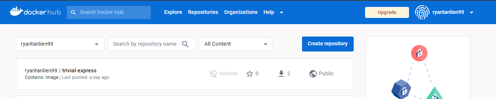
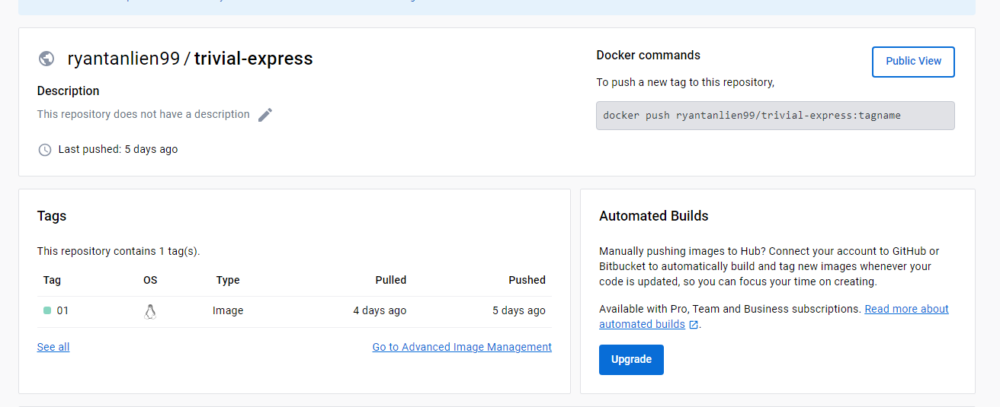
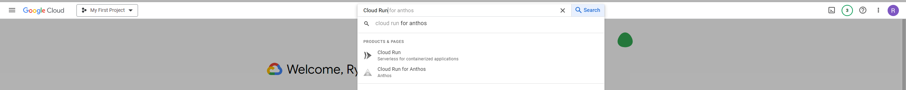
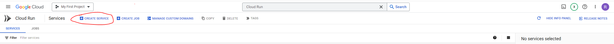
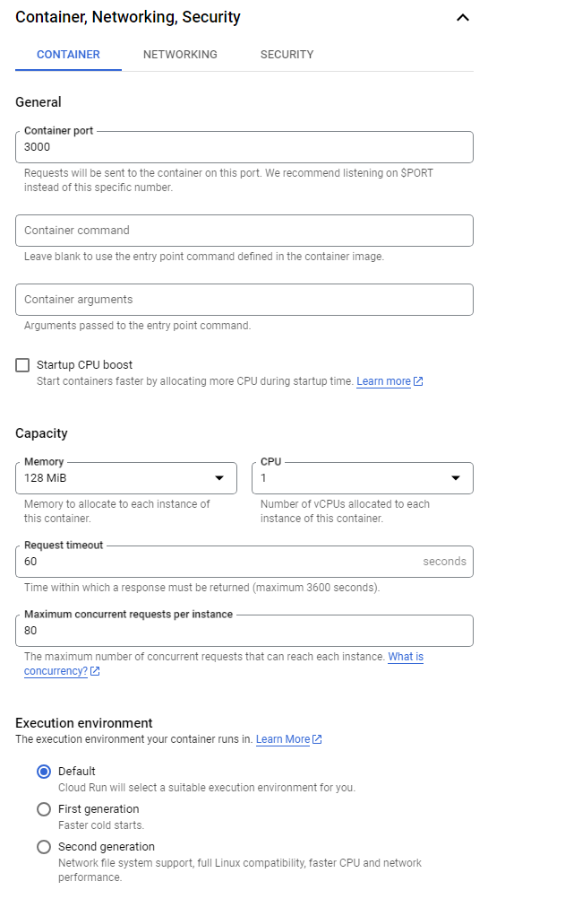
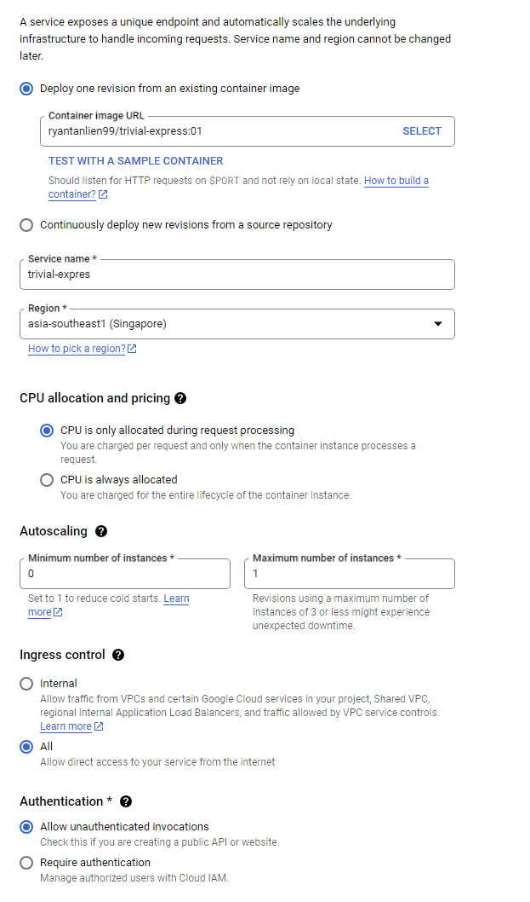

# Trivial Express Google Cloud and Continous Deployment
Welcome to the repository! Most likely, if your are visiting this repository, you are coming from CS3219 Software Engineering from NUS, doing one of the labs on Continous Deployment.

This repository serves as a guide to get your basic containerized Node.js application deployed on Google Cloud. Of course, any application can be deployed to Google Cloud with Docker but I have chosen to use Express and Node.js as these are what I am familiar with.

## Prerequisites
There are certain prequisites that one needs to have before attempting this guide. These are listed down below.

### Software Versions
Please do use whatever software versions are comfortable for you. Do note however that additional configuration and dependency management will be required if you decide to use versions different from the one in this repository.
- `Node.js v14.17.3`
- `Node Package Manager v8.13.2`

### Accounts Required
1. Docker Hub
2. Google Cloud Free Trial (Note that it is valid only for 90 days)

### Software Required
1. Docker Desktop
2. Node.js
3. npm

### Skills Required
1. Basic Docker commands
2. An understanding of how Docker works

❗ It is highly recommended that you learn how to deploy an application on Google Cloud without Continous Deployment first, to learn how the cloud framework works. Writing a script on GitHub Actions to deploy continously can be potentially destructive or extremely costly.

## Deploying on Google Cloud Run with no Continous Deployment
Lets say that you have an existing node application, preferably a microservice that you wish to deploy on Google Cloud. This node application can be containerized and deployed. 

I will be using the trivial Express Node.js server in the `app` directory as the deployment example.

### Creating a Docker Hub Repository
1. Go to Docker Hub at https://hub.docker.com/
2. Log in
3. Create a public repository, preferably with the same name as your application. This will be the same name as your container. (Click create repository)

We will push built containers to the repository above.



### Building the Container
- Navigate to the `app` directory or whichever folder your app is located in.
- Ensure that there is a Dockerfile within the directory if you are writing your own or alternatively, use the one that I have provided. (Some configuration may be needed to fit your own application)
- Run the following commands:
  - `docker build . -t {dockerhubusername}/{app-name}:{tag-name}`
  - This command builds the docker image that we will push to Docker Hub (A repository for your containers just as GitHub is a repository for your code)

### Pushing the Container to Docker Hub
- Carrying on from the *Building the Container* section, run the following commands:
  - `docker push {dockerhubusername}/{app-name}:{tag-name}`

I used ryantanlien99/trivial-express:01 as the overall designation for the container and you will see it appear under the tags section in the repository.



### Deploying the Container to Google Cloud Run
We will be using the Google Cloud Dashboard to deploy the container. The Google Cloud CLI can also be used but requires a lot more setup.

1. Go to Google Cloud Dashboard.
2. Go to Google Cloud Run
  

3. Create a service by clicking on the `Create Service Button` and place `{dockerhubusername}/{app-name}:{tag-name}` as the Container URL when setting up the service. Google Cloud will automatically fetch the Docker Container and deploy it once the service is created.
  

#### General Deployment Settings
4. Use the following settings for this example: (Intended for ease of use and low credit usage)
    - Region: `asia-southeast1 (Singapore)`
    - CPU allocation and pricing: `CPU is only allocated during request processing`
    - Autoscaling:
      - Minimum number of instances: 0
      - Maximum number of instances: 1
    - Ingress control: All (Required to access it on your browser without provisioning a load balancer)
    - Authentication: Allow unauthenticated invocations (Required for now)



#### Container, Networking and Security
5. Use the following settings for this example
    - General/Container port: 3000 (Should be whatever you specified in the Dockerfile if you used a custom config)
    - Capcaity: 128 MiB (Provision more if you need)
    - CPU: 1 (Provision more if you need)
    - Request Timeout: 60
    - Maximum concurrent requests per instance: 10 (Provision more if you need)



⚠️Important Note: For the rest of the settings, since this deployment is trivial and does not use any other cloud databases or require any additional provisioning of infrastructure, we won't need things such as environment variables and secrets. However, for a non-trivial example with other infrastructure such as load balancers and database access, the secrets and environment variables will have to be configured. (Please do not hardcode your GitHub or Cloud secrets into your application)

#### Accessing the endpoint
6. Wait until the container is provisioned and deployed. 
7. Once it is, a link should appear. Hit that API endpoint and the following message should pop up: `hello world`
8. If other endpoints in your application are exposed such as POST endpoints, then those would have to test those with Postman.

## Deploying on Google Cloud Run with Continous Deployment
This section assumes that you have already tried a deployment on Google Cloud Run without Continous Deployment by following the steps above.

### Additional Software/Accounts Required
1. GitHub

### GitHub Actions
There are many continous deployment frameworks that one can use such as Jenkins or Google Cloud's own Cloud Build or GitHub Actions. Due to the accessibility and cost (it's free!) of GitHub Actions and GitHub, we will use GitHub Actions.

GitHub Actions is simply a script configured using a YAML file that triggers when events we specify occur.

For more information visit the [Official Documentation for GitHub Actions](https://docs.github.com/en/actions/learn-github-actions/understanding-github-actions)

These scripts must be placed inside the directory location `./github/workflow` in your GitHub repository.

We will place the script `cd-script.yml` inside this directory location.

#### Continous Deployment YAML File
The file that we use is outlined below:
```

```

The script first builds your image to Docker Hub and then deploys it to Google Cloud Run using a custom GitHub Action Workflow called `deploy-cloudrun` which is maintained by OSS. 

For more info on Docker and GitHub Actions visit: [Introduction to GitHub Actions](https://docs.docker.com/build/ci/github-actions) by Docker

For more info about `deploy-cloudrun` visit: 

We will only briefly go through some important key words. For a full list of what can be used, checkout the [Official Workflow Syntax for GitHub Actions](https://docs.github.com/en/actions/using-workflows/workflow-syntax-for-github-actions)

**Generic GitHub Actions Syntax**

- `name:` This sets the name of the workflow
- `on:` This specifies the events that trigger the workflow  
- `runs-on:` This specifies the operating system on which the job will run. We use`ubuntu-latest`, which represents the latest version of Ubuntu available on GitHub Actions.
- `steps:` This section contains a list of steps to be executed in the job. Steps are the individual units of work that run commands or actions

**Docker Specific GitHub Actions Syntax**

This section applies to the steps: `Build and push` of the `deploy_trivial_express` job. 

- The `with:` key lists a number of input parameters that configures the step:
  - `context`: the build context.
  - `file`: filepath to the Dockerfile.
  - `push`: tells the action to upload the image to a registry after building it.
  - `tags`: tags that specify where to push the image this is your Docker Hub Image designation.

This next section applies to the steps `Log in to Docker Hub` of the `deploy_trivial_express job`.

- The `with:` key lists a number of input parameters that configures the step:
  - `username:` Docker Hub / Docker Desktop username
  - `password:` Docker Hub / Docker Desktop password
These are required for GitHub Actions to gain privileges to Docker Hub's API to push the image through automation for you.