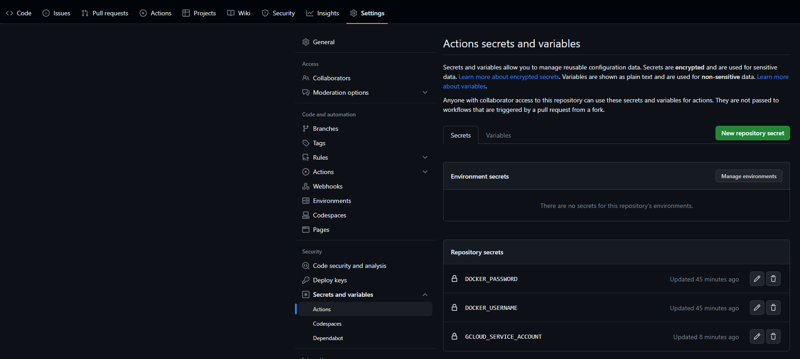

# Trivial Express Google Cloud and Continous Deployment
Welcome to the repository! Most likely, if your are visiting this repository, you are coming from CS3219 Software Engineering from NUS, doing one of the labs on Continous Deployment.

This repository serves as a guide to get your basic containerized Node.js application deployed on Google Cloud. Of course, any application can be deployed to Google Cloud with Docker but I have chosen to use Express and Node.js as these are what I am familiar with.

## Prerequisites
There are certain prequisites that one needs to have before attempting this guide. These are listed down below.

### Software Versions
Please do use whatever software versions are comfortable for you. Do note however that additional configuration and dependency management will be required if you decide to use versions different from the one in this repository.
- `Node.js v14.17.3`
- `Node Package Manager v8.13.2`

### Accounts Required
1. Docker Hub
2. Google Cloud Free Trial (Note that it is valid only for 90 days)

### Software Required
1. Docker Desktop
2. Node.js
3. npm

### Skills Required
1. Basic Docker commands
2. An understanding of how Docker works

❗ It is highly recommended that you learn how to deploy an application on Google Cloud without Continous Deployment first, to learn how the cloud framework works. Writing a script on GitHub Actions to deploy continously can be potentially destructive or extremely costly.

## Deploying on Google Cloud Run with no Continous Deployment
Lets say that you have an existing node application, preferably a microservice that you wish to deploy on Google Cloud. This node application can be containerized and deployed. 

I will be using the trivial Express Node.js server in the `app` directory as the deployment example.

### Creating a Docker Hub Repository
1. Go to Docker Hub at https://hub.docker.com/
2. Log in
3. Create a public repository, preferably with the same name as your application. This will be the same name as your container. (Click create repository)

We will push built containers to the repository above.


### Building the Container
- Navigate to the `app` directory or whichever folder your app is located in.
- Ensure that there is a Dockerfile within the directory if you are writing your own or alternatively, use the one that I have provided. (Some configuration may be needed to fit your own application)
- Run the following commands:
  - `docker build . -t {dockerhubusername}/{app-name}:{tag-name}`
  - This command builds the docker image that we will push to Docker Hub (A repository for your containers just as GitHub is a repository for your code)

### Pushing the Container to Docker Hub
- Carrying on from the *Building the Container* section, run the following commands:
  - `docker push {dockerhubusername}/{app-name}:{tag-name}`

I used ryantanlien99/trivial-express:01 as the overall designation for the container and you will see it appear under the tags section in the repository.


### Deploying the Container to Google Cloud Run
We will be using the Google Cloud Dashboard to deploy the container. The Google Cloud CLI can also be used but requires a lot more setup.

1. Go to Google Cloud Dashboard.
2. Go to Google Cloud Run
  

3. Create a service by clicking on the `Create Service Button` and place `{dockerhubusername}/{app-name}:{tag-name}` as the Container URL when setting up the service. Google Cloud will automatically fetch the Docker Container and deploy it once the service is created.
  

#### General Deployment Settings
4. Use the following settings for this example: (Intended for ease of use and low credit usage)
    - Region: `asia-southeast1 (Singapore)`
    - CPU allocation and pricing: `CPU is only allocated during request processing`
    - Autoscaling:
      - Minimum number of instances: 0
      - Maximum number of instances: 1
    - Ingress control: All (Required to access it on your browser without provisioning a load balancer)
    - Authentication: Allow unauthenticated invocations (Required for now)


#### Container, Networking and Security
5. Use the following settings for this example
    - General/Container port: 3000 (Should be whatever you specified in the Dockerfile if you used a custom config)
    - Capcaity: 128 MiB (Provision more if you need)
    - CPU: 1 (Provision more if you need)
    - Request Timeout: 60
    - Maximum concurrent requests per instance: 10 (Provision more if you need)


⚠️Important Note: For the rest of the settings, since this deployment is trivial and does not use any other cloud databases or require any additional provisioning of infrastructure, we won't need things such as environment variables and secrets. However, for a non-trivial example with other infrastructure such as load balancers and database access, the secrets and environment variables will have to be configured. (Please do not hardcode your GitHub or Cloud secrets into your application)

#### Accessing the endpoint
6. Wait until the container is provisioned and deployed. 
7. Once it is, a link should appear. Hit that API endpoint and the following message should pop up: `hello world`
8. If other endpoints in your application are exposed such as POST endpoints, then those would have to test those with Postman.

## Deploying on Google Cloud Run with Continous Deployment
This section assumes that you have already tried a deployment on Google Cloud Run without Continous Deployment by following the steps above. It will also assume that you already have a Google Cloud Run service setup appropiately, and hence this Continous Deployment Script only creates new revisions of the service by uploading new containers.

### Additional Software/Accounts Required
1. GitHub

### Additional Configuration to be Performed (Google Cloud and GitHub Repository Secrets)
This section contains sensitive information and so screenshots will be minimal.
1. Enable IAM for your Google Cloud Run Project
2. Obtain the Service User Account ID for your Google Cloud Run Project (We will need this later)
    - It's ID is under the `Principal` field
    - Add your Service User Account ID for your Google Cloud Run Project as a Secret in your GitHub Repository.
3. Obtain the ID for the Google Cloud Run Project and add it as a Secret in your GitHub Repository.
3. Make the Service User Account a Service Account Token Creator (We will need this later)
    - Go to IAM & Admin section of Google Cloud Dashboard and click on the pencil icon next the the automatically generated service account.
    - Add a new Role to it called Service Account Token Creator.
4. Generate a Service Key for the Google Cloud Service Account and add it as a Secret in your GitHub Repository as `SERVICE_JSON`.
    - Got to IAM & Admin section of Google Cloud Dashboard and click on Service Accounts on the lefthand sidebar. Click more Actions and Click Manage keys. Add a Key
    - More info can be found [here](https://cloud.google.com/iam/docs/keys-create-delete)
5. Add your Docker User Name and Password for as Secrets in your GitHub Repository as `DOCKER_USERNAME` and `DOCKER_PASSWORD`

#### Adding Secrets to GitHub Repository


### GitHub Actions
There are many continous deployment frameworks that one can use such as Jenkins or Google Cloud's own Cloud Build or GitHub Actions. Due to the accessibility and cost (it's free!) of GitHub Actions and GitHub, we will use GitHub Actions.

GitHub Actions is simply a script configured using a YAML file that triggers when events we specify occur, running on a remote virtual machine is provisioned for us.

For more information visit the [Official Documentation for GitHub Actions](https://docs.github.com/en/actions/learn-github-actions/understanding-github-actions)

These scripts must be placed inside the directory location `./github/workflows` in your GitHub repository.

We will place the script `cd-script.yml` inside this directory location.

#### Continous Deployment YAML File
The file that we use is outlined below:
``` YAML
name: CD

# Controls when the action will run. Triggers the workflow on push 
# events but only for the master branch
on: 
  pull_request:
    types:
      - closed
    branches: [ main ]
  push:
    branches: [ main ]

jobs:
  push_trivial_express_container:
    # if: github.event.pull_request.merged == true
    runs-on: ubuntu-latest

    steps:
    - name: Check out the repo
      uses: actions/checkout@v3

    - name: Set up QEMU
      uses: docker/setup-qemu-action@v2

    - name: Set up Docker Buildx
      uses: docker/setup-buildx-action@v2

    - name: Log in to Docker Hub
      uses: docker/login-action@v2
      with: 
        username: ${{ secrets.DOCKER_USERNAME }}
        password: ${{ secrets.DOCKER_PASSWORD }}

    - name: Build and push Docker image
      uses: docker/build-push-action@v4
      with:
        context: ./app
        push: true
        tags: ryantanlien99/trivial-express:01

  deploy_trivial_express:
    needs: push_trivial_express_container
    runs-on: ubuntu-latest
    permissions:
      contents: 'read'
      id-token: 'write'

    steps:
    - name: 'Check out the Repo'
      uses: 'actions/checkout@v3'

    - name: 'Authenticate Google Cloud'
      uses: 'google-github-actions/auth@v1'
      with:
        service_account: '${{ secrets.GCLOUD_SERVICE_ACCOUNT}}'
        credentials_json:  '${{ secrets.SERVICE_JSON }}'

    - name: 'Set up Google SDK'
      uses: 'google-github-actions/setup-gcloud@v1'
      with:
        version: 'latest'
        project: '${{ secrets.GCLOUD_RUN_PROJECT_ID }}'
    
    - name: 'Download trivial-express YAML configuration file'
      run: 'gcloud run services describe trivial-express --region asia-southeast1 --format export > service.yaml'

    - name: 'Redeploy trivial-express service with new revision'
      run: 'gcloud run services replace service.yaml'
```

The script first builds your image to Docker Hub and then deploys it to Google Cloud Run using the Google CLI.
- In order to use the Google CLI in our action, we will first have to authenticate Google Cloud. For Authentication, we will use the `google-github-actions/auth` GitHub Actions. 
- After authentication, we will have to setup the Google Cloud CLI in the virtual machine running our GitHub Action Script. We will use the `google-github-actions/setup-gcloud` GitHub Action to install the Google Cloud CLI. Details on what the script does can be inferred from the key syntax provided below.
- Once that is done, we will use the Google Cloud CLI to regenerate the Service Configuration YAML file of our Google Cloud Run Service which triggers a new deployment of the service.

For more info on Docker and GitHub Actions visit: [Introduction to GitHub Actions](https://docs.docker.com/build/ci/github-actions) by Docker

For more info on Google Cloud CLI, visit: [Google Cloud SDK Reference](https://cloud.google.com/sdk/gcloud/reference)

For more info about the GitHub Actions used above visit [google-github-actions/auth](https://github.com/google-github-actions/auth) and [google-github-actions/setup-gloud](https://github.com/google-github-actions/setup-gcloud)


We will only briefly go through some important key words. For a full list of what can be used, checkout the [Official Workflow Syntax for GitHub Actions](https://docs.github.com/en/actions/using-workflows/workflow-syntax-for-github-actions), as well as the documentation listed above.

#### Generic GitHub Actions Syntax

- `name:` This sets the name of the workflow.
- `on:` This specifies the events that trigger the workflow.
- `runs-on:` This specifies the operating system on which the job will run. We use`ubuntu-latest`, which represents the latest version of Ubuntu available on GitHub Actions.
- `jobs:` This section defines one or more jobs for the workflow. Each job represents a set of steps that run on the same runner.
- `steps:` This section contains a list of steps to be executed in the job. Steps are the individual units of work that run commands or actions.
- `needs:` This specifies dependencies between jobs.

#### Docker Specific GitHub Actions Syntax

This section applies to the steps: `Build and push` of the `push_trivial_express_container` job. 

- The `with:` key lists a number of input parameters that configures the step:
  - `context`: the build context.
  - `file`: filepath to the Dockerfile.
  - `push`: tells the action to upload the image to a registry after building it.
  - `tags`: tags that specify where to push the image this is your Docker Hub Image designation.

This next section applies to the steps `Log in to Docker Hub` of the `push_trivial_express_container` job.

- The `with:` key lists a number of input parameters that configures the step:
  - `username:` Docker Hub / Docker Desktop username.
  - `password:` Docker Hub / Docker Desktop password.
These are required for GitHub Actions to gain privileges to Docker Hub's API to push the image through automation for you.

#### Deploy Cloud Run GitHub Actions Syntax
- Syntax pertaining to `Authenticate Google Cloud Step`
  - `service account:` The service account configured by Google Cloud IAM API to be able to access Google Cloud from third party applications.
  - `credentials_json` JSON of the Service Key generated for the Service Account

- Syntax pertaining to `Set up Google SDK`
  - `version:` The version of Google Cloud CLI that we are installing
  - `project:` The project id of the project that we wish to run Google Cloud CLI commands. This can be overwritten by the command flags.

#### Google Cloud CLI Commands Explanation
This section is adapted from the [Cloud Run Official Documentation: Deploying a new revision](https://cloud.google.com/run/docs/deploying#revision)

This sections run Google Cloud CLI commands on the project specified above. It essentially downloads the existing configuration YAML of the Google Cloud Run Service that we have setup and reuploads it, forcing an update of the container image.

- Explanation of commands in `Download trivial-express YAML configuration file` 
  - We specify the region of our service with `--region` flag for gcloud to locate the service. 
  - We then format and export the output of the gcloud service description to our virtual machine environment with `export > service.yaml`

- Explanation of commands in `Redeploy trivial-express service with new revision`
  - We simply replace the existing service configuration file in the cloud service with the one we have downloaded, forcing a redeployment of the service. If the container image is updated in earlier steps (which it is), it deploys the new container to the service.
  - For more info about the commands and available flags, visit: [Google Cloud SDK Reference](https://cloud.google.com/sdk/gcloud/reference)

## Conclusion
Congratulations! You have now completed the entire guide on how to deploy your Node.js application/microservice to Google Cloud Run with and without Continous Deployment. Hopefully this has enlightened you how to use Google Cloud Run and GitHub Actions to automate your workflows! 

⚠️ This guide was written by consulting many of the references listed below. For a more in-depth understanding of how to setup your own personalized workflows, or if you require a clearer understanding, do read the same references.

## Follow-up challenges
Here are some follow-up challenges that will help to enhance your learning on the subject.

### Exercise 1: Deploy a new revision of the service
Change the logic of your application and expose a new endpoint. Then run this workflow in your repository and test whether the container containing your new application has been updated on Google Cloud Run.

### Exercise 2: Change this script to deploy a new service if it does not exist
Hint: use the [deploy-cloud-run](https://github.com/google-github-actions/deploy-cloudrun) GitHub Action and scripting to alter/create the contents of Google Cloud Service YAML. See: [Cloud Run Official Documentation: Deploying a new service](https://cloud.google.com/run/docs/deploying#service).

To check if the service exists use scripting with the `run` keyword.

### Exercise 3: Change this script to only activate on a closed pull request that merged to master.
Hint: use the `if` keyword on the `push_express_container` and `deploy_trivial_express` jobs.

## References
- [Introduction to GitHub Actions](https://docs.docker.com/build/ci/github-actions)
- [Google Cloud Documentation: Create and delete service account keys](https://cloud.google.com/iam/docs/keys-create-delete)
- [Google Cloud Documentation: Manage Service Accounts](https://cloud.google.com/iam/docs/manage-access-service-accounts)
- [Cloud Run Official Documentation: Deploying a new revision](https://cloud.google.com/run/docs/deploying#revision)
- [Cloud Run Official Documentation: Deploying a new service](https://cloud.google.com/run/docs/deploying#service)
- [Cloud Run Official Documentation: Configure Containers](https://cloud.google.com/run/docs/configuring/services/containers)
- [Google Cloud SDK Reference](https://cloud.google.com/sdk/gcloud/reference)
- [Official Workflow Syntax for GitHub Actions](https://docs.github.com/en/actions/using-workflows/workflow-syntax-for-github-actions)
- [google-github-actions/auth](https://github.com/google-github-actions/auth)
- [google-github-actions/setup-gloud](https://github.com/google-github-actions/setup-gcloud)
